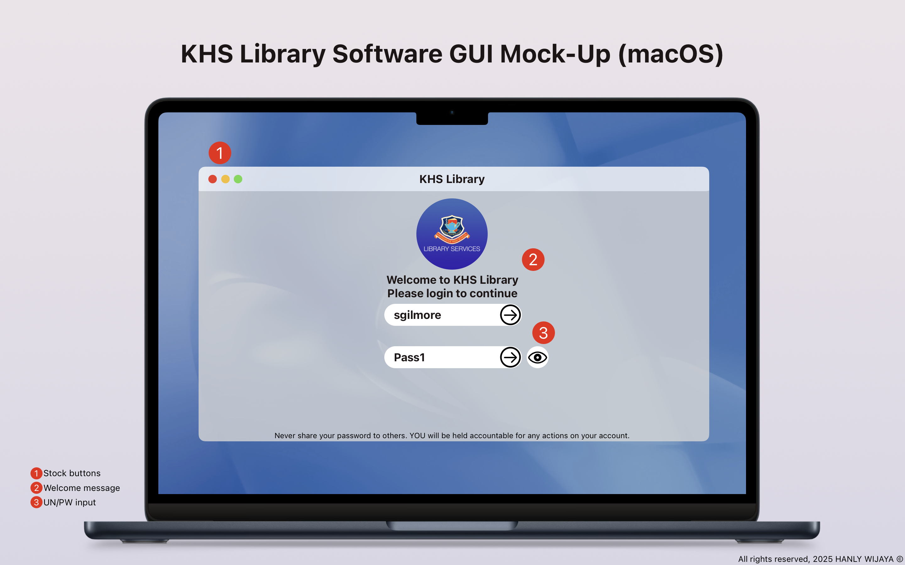
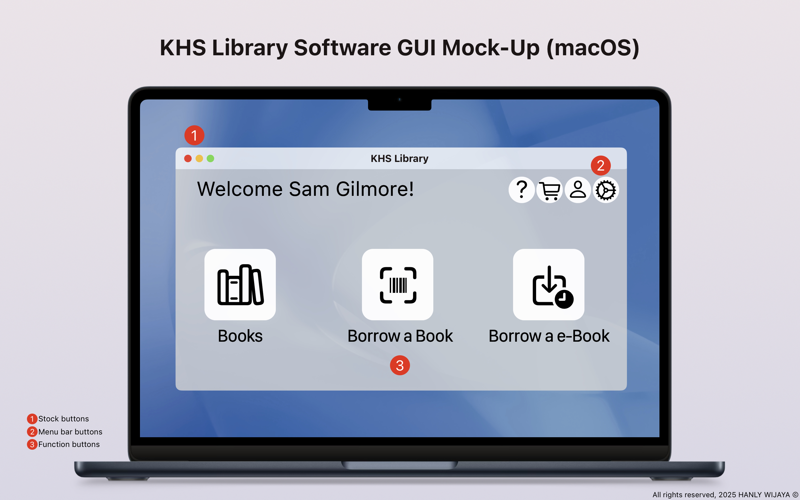
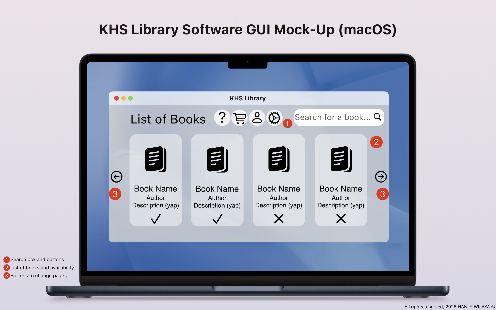
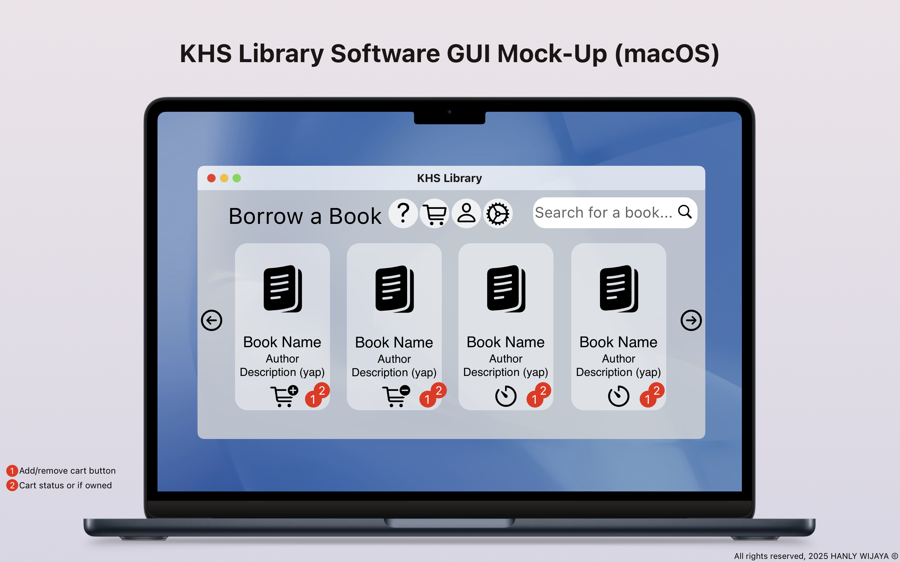
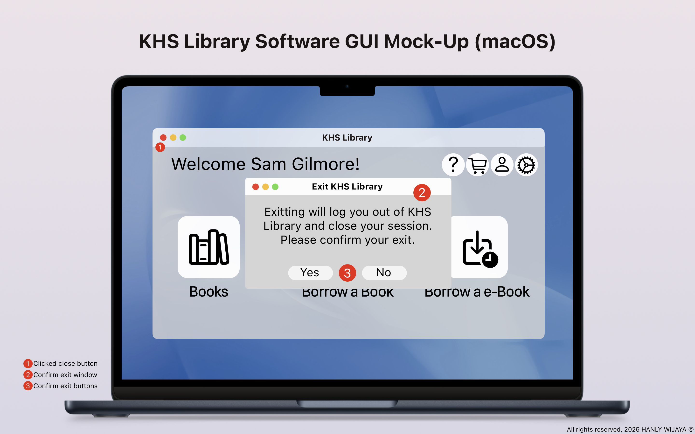

- **An all in one tool to view & borrow the library books of Kingsgrove High School**
- Supported on **Windows, macOS and Linux**

# Prerequisites
- **Python**
- **Terminal/Command Prompt**

# Compatibility
**Python** - **can be used** in **Windows' command prompt**, **macOS/OS X/Mac OS X's Terminal** and **Linux's terminal or command prompt.**

# References for code
YouTube -
https://www.youtube.com/shorts/_Q-PxvKfv8Y
https://www.youtube.com/watch?v=evNOzLfdo6U
https://www.youtube.com/watch?v=KAXvMbD1Zac
https://www.youtube.com/watch?v=-MZiQaNI0QA

EduBirdie -
https://edubirdie.com/docs/university-of-regina/cs-100-introduction-to-computers/45840-user-authentication-program-using-python-dictionary

TPointTech -
https://www.tpointtech.com/login-module-in-python

SimpliLearn -
https://www.simplilearn.com/dictionary-in-python-article#:~:text=In%20Python%2C%20dictionaries%20are%20mutable,update()%2C%20dict.

StackOverflow -
https://stackoverflow.com/questions/47202331/python-username-and-password-with-3-attempts

coursera -
https://www.coursera.org/tutorials/python-break

programiz -
https://www.programiz.com/python-programming/methods/list/index
https://www.programiz.com/python-programming/break-continue

GitHub - LukeZGD - for inspiration and coding help
https://github.com/LukeZGD/Legacy-iOS-Kit

Reddit -
https://www.reddit.com/r/learnpython/comments/hsvw5w/if_vs_elif/

w3resource -
https://www.w3resource.com/python-exercises/tkinter/python-tkinter-dialogs-and-file-handling-exercise-2.php#:~:text=Python%20Tkinter%3A%20Creating%20an%20exit%20confirmation%20dialog&text=from%20tkinter%20import%20messagebox%20%E2%80%93%20Import,to%20save%20changes%20before%20exiting.
https://www.w3schools.com/python/python_arrays.asp

stackabuse -
https://stackabuse.com/bytes/handling-yes-no-user-input-in-python/

mimo -
https://mimo.org/glossary/python/time-sleep

python wiki -
https://wiki.python.org/moin/ForLoop

# GUI PROPOSAL (MOCKUP)

Library Login

KHS Function Menu

KHS List of Books

KHS Borrow Menu

KHS Exit Menu
# DISCLAIMER :
This is not official software to use in a deployed environment. This is a assessment task for my Software Engineering and those looking are highly encouraged to avoid using this for deployment.